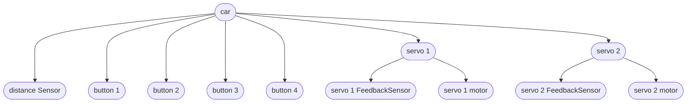
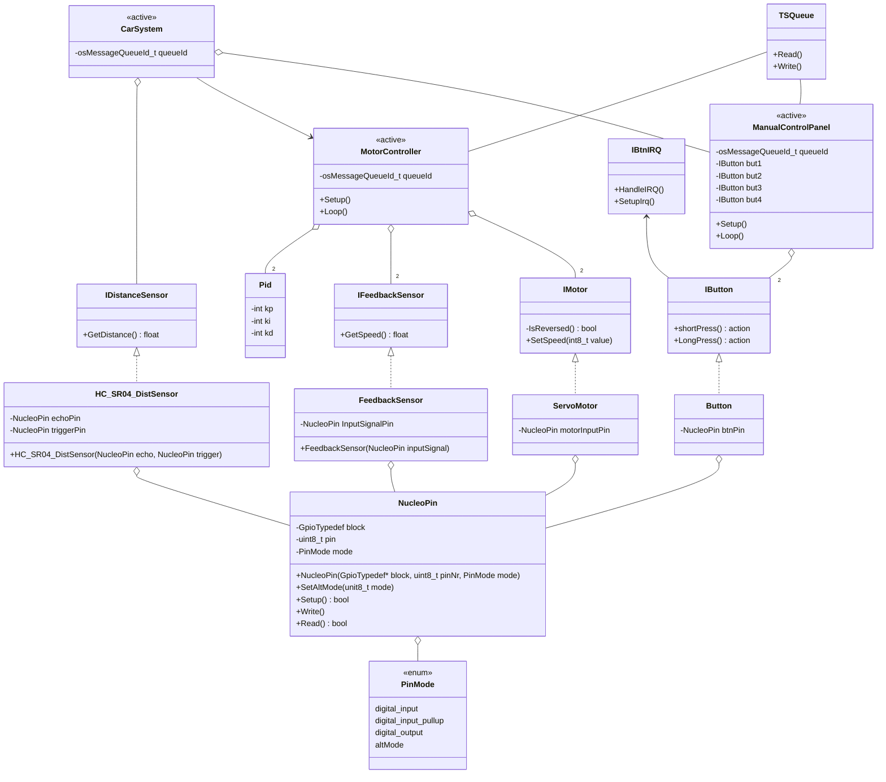
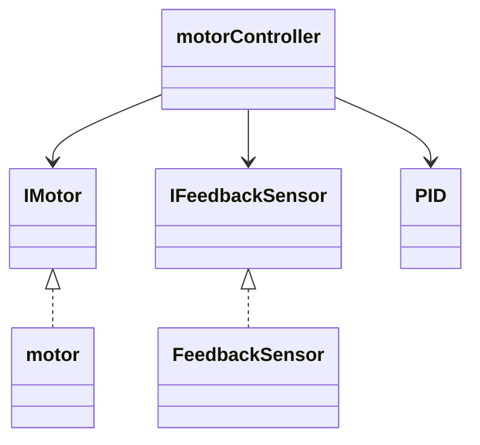
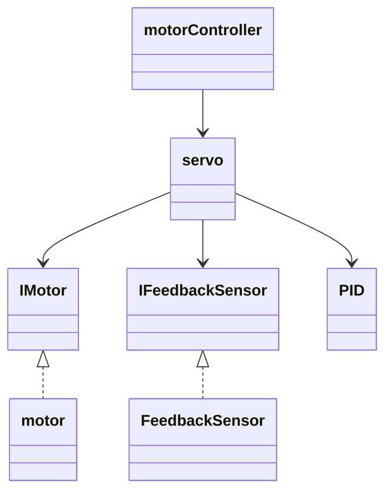
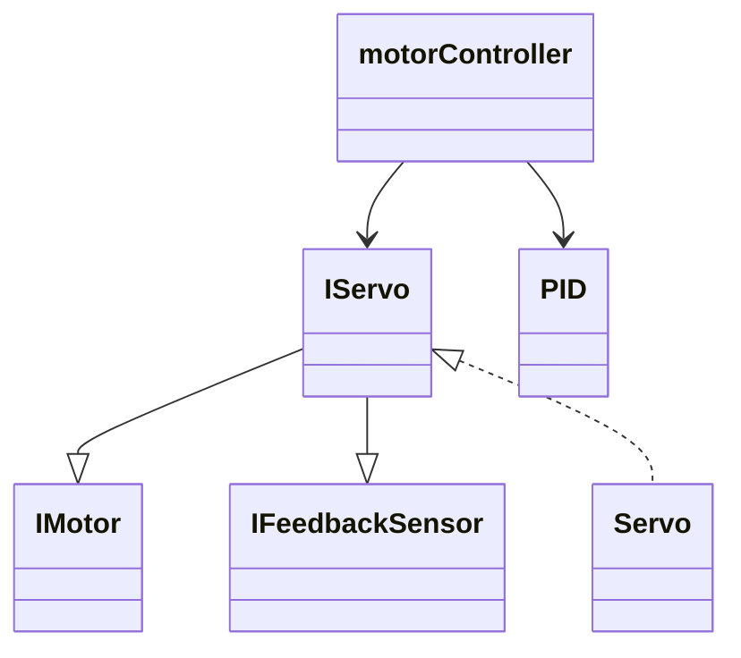

# diagrams

## object

| component | amount | input | output |
| :---: | :---: | :---: | :---: |
| servo | 2 | pwm in (50hz) | 1: motor movement, 2: pwm out (910hz) |
| distance FeedbackSensor | 1 | pin trigger pulse | pwm timing |
| button | 4 | physical interaction | interrupt |
<!-- |  |  |  | -->

## class

> `<<active>>` has its own thread. `TSQueue` = freeRtos messageQueue

### TODO

- why does motorController have 2 instances of the interfaces??
- add `HardwareTimer` to diagram
- add `update()` to `CarSystem`
- add `Logger` class

### notes

- IMotor::SetSpeed argument range: `0` - ±`100`
- `action` => `std::function<void()>`

## servo design posibilities

- todo
  - compare with S.O.L.I.D.
    - S - single responsability
    - O - open closed
    - L - liskov substitution
    - I - interface segregation
    - D - dependency inversion

### design 1

> my choice

pros

- lower nesting level
- easier overview

cons

- motorcontroller can be seen to have multiple responsabilities
  - required(?) for a closed loop system

---

### design 2

pros

- can simplifies control

cons

- can obfuscate parts
- does not adhere to Solid L
- unnecasary class inserted

---

### design 3

pros

- ...

cons

- tightly coupled low level
- seperation of conserns
- merges 2 interfaces
- hard to extend (solid O)

---
