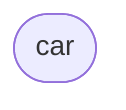
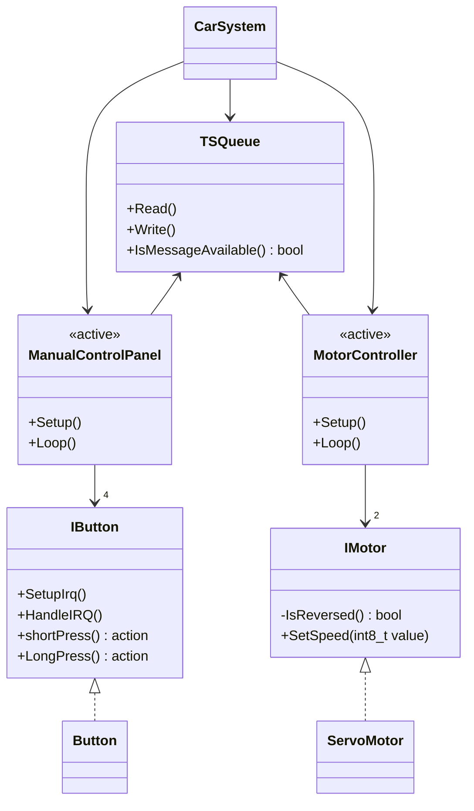

# diagrams

## object

```mermaid
graph
c([car])
```

## class

> `<<active>>` has its own thread

```mermaid
classDiagram
    class CarSystem
    class MotorController {
        <<active>>
        +Setup()
        +Loop()
    }
    class IMotor {
        -IsReversed() bool
        +SetSpeed(int8_t value)
    }
    class IButton {
        +SetupIrq()
        +HandleIRQ()
        +shortPress() action
        +LongPress() action
    }

    class ServoMotor
    class Button

    class ManualControlPanel {
        <<active>>
        +Setup()
        +Loop()
    }

    class TSQueue {
        +Read()
        +Write()
        +IsMessageAvailable() bool
    }

    %% *.. == is a
    %% <-- == has a
    %% <|.. == implements interface

    MotorController --> "2" IMotor

    ManualControlPanel --> "4" IButton

    IMotor <|.. ServoMotor
    IButton <|.. Button

    CarSystem --> ManualControlPanel

    TSQueue <-- ManualControlPanel
    TSQueue <-- MotorController

    CarSystem --> TSQueue
    CarSystem --> MotorController
```

### notes

- IMotor::SetSpeed argument range: `0` - ±`100`
- `action` => `std::function<void()>`
