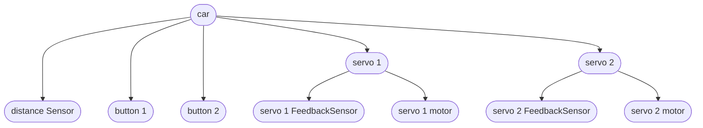
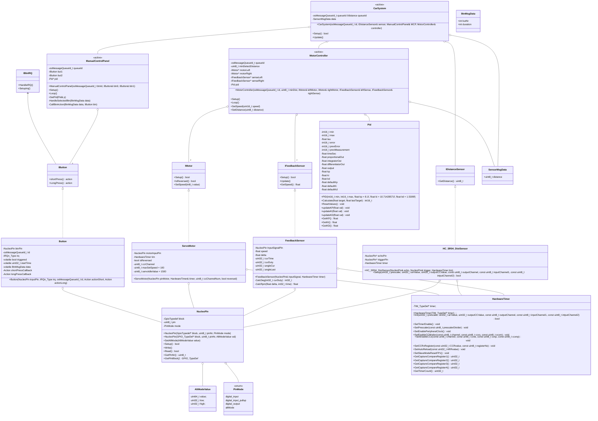
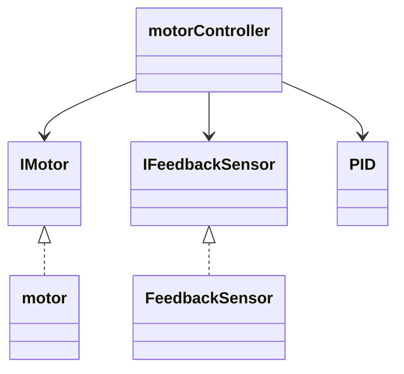
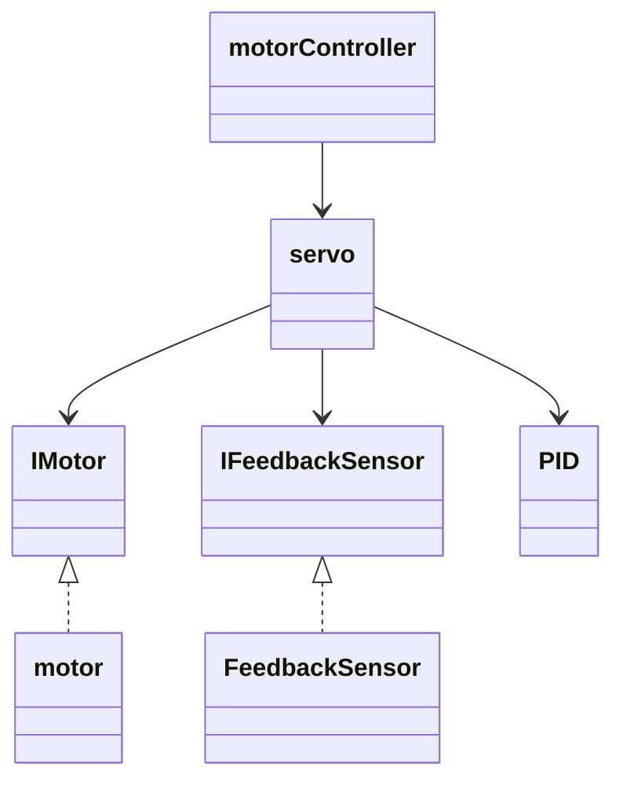
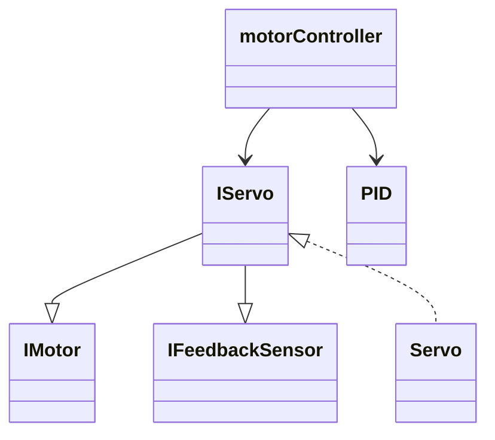

# diagrams

## object

## pinout

check [pinout table](pinout.md#pins)

## class

> `<<active>>` has its own thread.  
> `Action` = std::function\<void()\> or void(*func)(void) depending on the memory impact  
> the rule of 3 applies to classes (ctor, dtor, asignment-operator)

### notes

- IMotor::SetSpeed argument range: `0` - ±`100`
- `action` => `std::function<void()>`

## servo design posibilities

- todo
  - compare with S.O.L.I.D.
    - S - single responsability
    - O - open closed
    - L - liskov substitution
    - I - interface segregation
    - D - dependency inversion

### design 1

> my choice

pros

- lower nesting level
- easier overview

cons

- motorcontroller can be seen to have multiple responsabilities
  - required(?) for a closed loop system

---

### design 2

pros

- can simplifies control

cons

- can obfuscate parts
- does not adhere to Solid L
- unnecasary class inserted

---

### design 3

pros

- ...

cons

- tightly coupled low level
- seperation of conserns
- merges 2 interfaces
- hard to extend (solid O)

---
