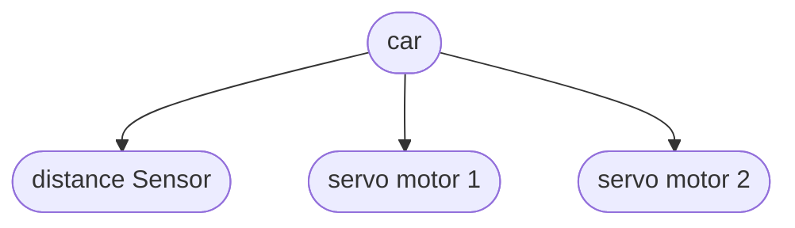
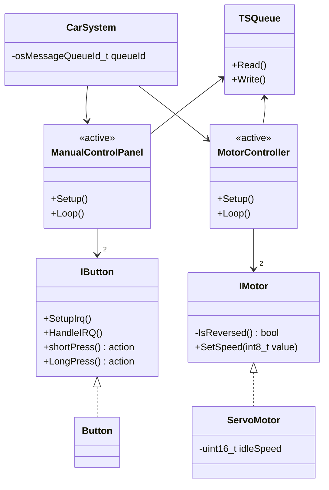

# diagrams

## object

## class

> `<<active>>` has its own thread. `TSQueue` = freeRtos messageQueue

## todo

- add distance sensor to graph

### notes

- IMotor::SetSpeed argument range: `0` - ±`100`
- `action` => `std::function<void()>`
