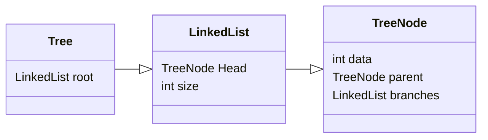
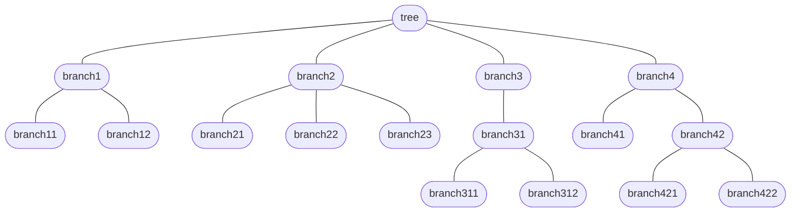

# graph vs tree notes

- copy previous assignment over
- remove assignment specific code
- implement treeNode struct
  - \+ functions
  - parse tree recursively

## layout

```mermaid
classDiagram
  direction LR
  class Tree{
    LinkedList root
  }
  class LinkedList {
    TreeNode Head
    int size
  }
  class TreeNode {
    int data
    TreeNode parent
    LinkedList branches
  }

  Tree --|> LinkedList
  LinkedList --|> TreeNode

```

```mermaid
  graph TD
  t([tree])
  b1([branch1])
  b2([branch2])
  b3([branch3])
  b4([branch4])

  b11([branch11])
  b12([branch12])

  b21([branch21])
  b22([branch22])
  b23([branch23])
  
  b31([branch31])
  
  b311([branch311])
  b312([branch312])
  
  b41([branch41])
  b42([branch42])
  
  b421([branch421])
  b422([branch422])

  t --- b1
  t --- b2
  t --- b3
  t --- b4

  b1 --- b11
  b1 --- b12

  b2 --- b21
  b2 --- b22
  b2 --- b23

  b3 --- b31

  b31 --- b311
  b31 --- b312
  
  b4 --- b41
  b4 --- b42

  b42 --- b421
  b42 --- b422

```
