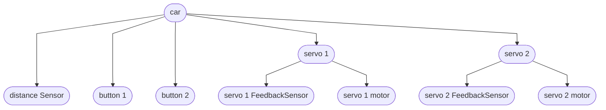
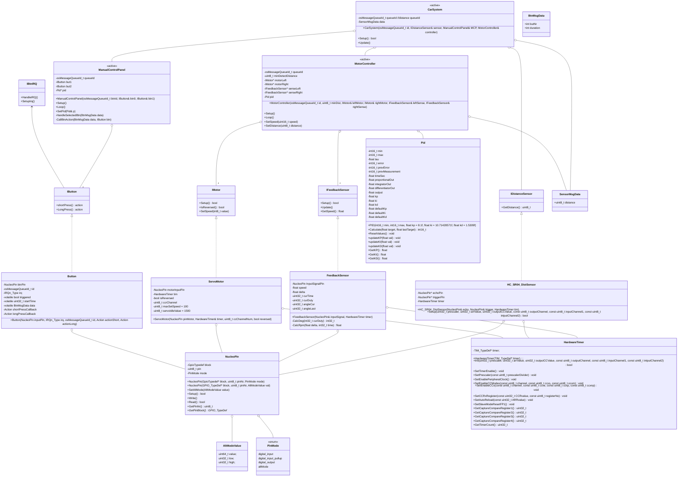

# car challenge report

2024-01-17
Karlo Koelewijn

## history

| date | version | author | notes |
| :---: | :---: | :---: | --- |
| 2024-01-17 | 0.1 | Karlo | added layout + started research |
| 2024-01-20 | 0.2 | Karlo | fleshed out the subquestions, added class diagram, added todo list |
<!-- |  |  |  |  | -->

## content

- [car challenge report](#car-challenge-report)
  - [history](#history)
  - [content](#content)
  - [introduction](#introduction)
  - [research](#research)
    - [main question](#main-question)
    - [subquestions](#subquestions)
      - [what parts does the car have?](#what-parts-does-the-car-have)
      - [how do i control the actuators? / how do i control the sensors?](#how-do-i-control-the-actuators--how-do-i-control-the-sensors)
      - [how do i control the car while its running?](#how-do-i-control-the-car-while-its-running)
      - [what is an obstacle?](#what-is-an-obstacle)
      - [how do i communicate between threads while keeping it in real time?](#how-do-i-communicate-between-threads-while-keeping-it-in-real-time)
    - [deepdive](#deepdive)
  - [design](#design)
    - [class diagram](#class-diagram)
  - [advice](#advice)
  - [conclusion](#conclusion)
  - [TODO](#todo)

## introduction

## research

### main question

how do I get the Nucleo car driving and avoiding obstacles using low level hardware control in real-time?

### subquestions

#### what parts does the car have?

*robohub*

#### how do i control the actuators? / how do i control the sensors?

the servos used are the `parallax inc. feedback 360 highspeed`, which are controlled using a 100 KHz pwm signal.  
by using the ccr (Capture Compare registers) you are able to manipulate the width of the duty cycle of the pwm signal.  
the servo responds to a signal between 1280 and 1720, which are the values that we put into the ccr.  
to controll them in a closed loop you can either:

1) choose to read the 910 hz pwm output signal, or
2) use a distance sensor

either option could be used as part of the pid controller.

as for controlling the distance sensor, this can be controlled using pwm pulse mode.  
that means u only send a pulse at the begining of the pwm signal on the trigger pin and read the resulting pwm signal from the echo pin.  
then after a calculation you get the distance from an obstacle.

the buttons on the other hand use interrupts, so when the button is pressed an interrupt is triggerd in the cpu.  
the cpu then executes its interupt handler (corosponding to the correct interrupt) and after which return to where it was before.  
it is essential that interrupts are short as to not loose track of other time sensitive tasks/threads.  
to keep mine short i only set a bool to true and save how long it has been pressed for on letting the button go.  
after which it can handle the button press whenever it has 'time' outside of the interrupt.

#### how do i control the car while its running?

while the assignment said that we needed to make our own software-serial, because the nucleo did not have enough pin,
i was able to allocate all the pins without needing to use the software-serial i had writen.  
i did use serial to set the individual Kp, Ki, and Kd values while the car was running so i did not have to recompile every time i had to change a value.  
another method to control the car was by adding a MCP (Manual Control Panel), for that i added 2 buttons where each button had a short and a long press action.  
they utilize a combination of interrupts and a messageQueue to decide what action gets executed.

#### what is an obstacle?

an obstacle is anything the distance sensor can sense within N cm for longer than a few measurements

#### how do i communicate between threads while keeping it in real time?

the nucleo f303re has a single ARM Cortex M4 core, so if we want to use multiple threads we are going to need an os.
thats where FreeRtos steps in, FreeRtos (or Free Real time operating system) provides a cross-platfrom operating system with threading capabilities.
which allowes us too make multiple threads while the kernal keeps the system running at 'real-time'.

to communicate between threads we can use one of freeRtos' features called a messageQueue,
you are able to push messages to the queue from one thread while another thread is able to pop them while the kernal keeps everything running.

### deepdive

## design

<!-- TODO finish design-->
<!-- TODO explain design choices (for example: why motorcontroller takes 2 motors)-->

### class diagram

`<<active>>` means that it has a separate thread.  
`Action` = std::function\<void()\> or void(*func)(void) depending on the memory impact.  
the rule of 3 applies to classes (ctor, dtor, asignment-operator).  
IMotor::SetSpeed argument range: `-100` to `100`.

## advice

<!-- TODO -->

## conclusion

<!-- TODOf -->

## TODO

- intro
- finish research
- add subjects to deepdive
  - peek into [nucleo-notes](<nucleo-notes.md>)
- continue design
- advice
- conclusion
