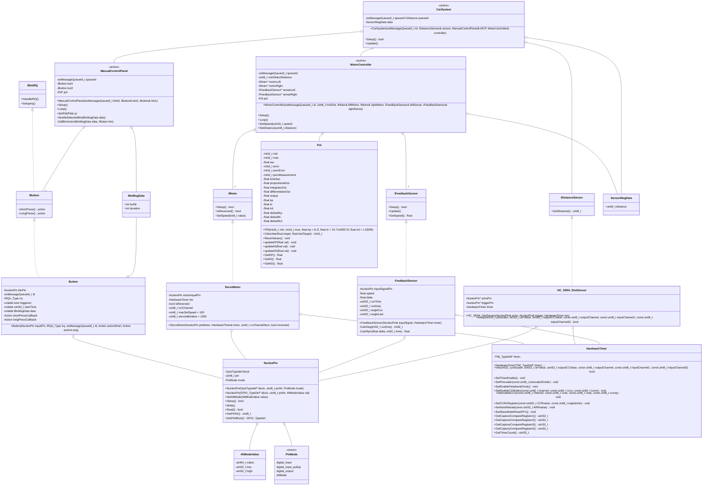

# car challenge report


2024-01-21  
Karlo Koelewijn

## history

| date | version | author | notes |
| :---: | :---: | :---: | --- |
| 2024-01-17 | 0.1 | Karlo | added layout + started research |
| 2024-01-20 | 0.2 | Karlo | fleshed out the subquestions, added class diagram, added todo list |
| 2024-01-21 | 0.3 | Karlo | added image, finished deepdive section, finished design, wrote advice, wrote conclusion |
<!-- |  |  |  |  | -->

## content

- [car challenge report](#car-challenge-report)
  - [history](#history)
  - [content](#content)
  - [introduction](#introduction)
  - [research](#research)
    - [main question](#main-question)
    - [subquestions](#subquestions)
      - [what parts does the car have?](#what-parts-does-the-car-have)
      - [how do i control the actuators? / how do i control the sensors?](#how-do-i-control-the-actuators--how-do-i-control-the-sensors)
      - [how do i control the car while its running?](#how-do-i-control-the-car-while-its-running)
      - [what is an obstacle?](#what-is-an-obstacle)
      - [how do i communicate between threads while keeping it in real time?](#how-do-i-communicate-between-threads-while-keeping-it-in-real-time)
      - [deepdive](#deepdive)
        - [pwm output control](#pwm-output-control)
        - [pwm input control](#pwm-input-control)
          - [example pwm in+out](#example-pwm-inout)
        - [uart control](#uart-control)
        - [pid control](#pid-control)
  - [design](#design)
    - [class diagram](#class-diagram)
  - [advice](#advice)
  - [conclusion/reflection](#conclusionreflection)

## introduction

in this report im showing my learnings and choices during my work on the car challenge.  
the goal of this challenge is to get to know low-level hardware control on the nucleo f303re.  
we got the following goals in this challenge:

1. HAL methods are forbidden
    - with the exception of `HAL_Delay`, `HAL_UART_Transmint`, and `HAL_UART_Receive`
2. drive the servos in a closed loop with a pid
3. use the distance sensor for obstacle detection
4. make a MCP (Manual Control Panel)
5. have a backup system to control the car while it is running

## research

### main question

how do I get the Nucleo car driving and avoiding obstacles using low level hardware control in real-time?

### subquestions

#### what parts does the car have?


#### how do i control the actuators? / how do i control the sensors?

the servos used are the `parallax inc. feedback 360 highspeed`, which are controlled using a 100 KHz pwm signal.  
by using the ccr (Capture Compare registers) you are able to manipulate the width of the duty cycle of the pwm signal.  
the servo responds to a signal between 1280 and 1720, which are the values that we put into the ccr.  
to controll them in a closed loop you can either:

1) choose to read the 910 hz pwm output signal, or
2) use the distance from a distance sensor

either option could be used as part of the pid controller.

as for controlling the distance sensor, this can be controlled using pwm pulse mode.  
that means u only send a pulse at the begining of the pwm signal on the trigger pin and read the resulting pwm signal from the echo pin.  
then after a calculation you get the distance from an obstacle.

the buttons on the other hand use interrupts, so when the button is pressed an interrupt is triggerd in the cpu.  
the cpu then executes its interupt handler (corosponding to the correct interrupt) and after which return to where it was before.  
it is essential that interrupts are short as to not loose track of other time sensitive tasks/threads.  
to keep mine short i only set a bool to true and save how long it has been pressed for on letting the button go.  
after which it can handle the button press whenever it has 'time' outside of the interrupt.

#### how do i control the car while its running?

while the assignment said that we needed to make our own software-serial, because the nucleo did not have enough pin,
i was able to allocate all the pins without needing to use the software-serial i had writen.  
i did use serial to set the individual Kp, Ki, and Kd values while the car was running so i did not have to recompile every time i had to change a value.  
another method to control the car was by adding a MCP (Manual Control Panel), for that i added 2 buttons where each button had a short and a long press action.  
they utilize a combination of interrupts and a messageQueue to decide what action gets executed.

#### what is an obstacle?

an obstacle is anything the distance sensor can sense within N cm for longer than a few measurements

#### how do i communicate between threads while keeping it in real time?

the nucleo f303re has a single ARM Cortex M4 core, so if we want to use multiple threads we are going to need an os.
thats where FreeRtos steps in, FreeRtos (or Free Real time operating system) provides a cross-platfrom operating system with threading capabilities.
which allowes us too make multiple threads while the kernal keeps the system running at 'real-time'.

to communicate between threads we can use one of freeRtos' features called a messageQueue,
you are able to push messages to the queue from one thread while another thread is able to pop them while the kernal keeps everything running.

#### deepdive

##### pwm output control

to produce a pwm signal on the nucleo we need to use a timer.  
the nucleo has multiple timers:

- advanced timers (tim1/tim8/tim20)
- general-purpose timers (tim2/tim3/tim4)
- basic timers (tim6/tim7)
- general-purpose timers (tim15/tim16/tim17)
  - thise have less features

all timers except the 'basic timers' have the capability to output a pwm signal.  
to achive this you have to do the following steps.  
(using tim2 for this example)

1. enable specific timer  

    ```cpp
    RCC->APB1ENR |= RCC_APB1ENR_TIM2EN;
    ```

2. set the prescaler to desired speed

    ```cpp
    // 7.2 MHz / 72 = 100 KHz
    TIM2->PSC = 72 - 1; // -1 because the register starts at 1
    ```

3. set the ARR (auto reload register)

    ```cpp
    // set auto-reload register for desired time period
    // 100 KHz / 2000 = 50 Hz
    TIM2->ARR = 20000 - 1;
    ```

4. set the CCMR (Capture/Compare Mode Register)

    ```cpp
    // Set CCMR to output mode
    TIM2->CCMR1 = (
        (TIM2->CCMR1 & ~0b11) |
        (0b00 << 0)
    );
    ```

5. set output mdoe to pwm

    ```cpp
    TIM2->CCMR1 |= TIM_CCMR1_OC1M_1 | TIM_CCMR1_OC1M_2;
    ```

6. set CCR1 as output

    ```cpp
    TIM2->CCER = (
        (TIM2->CCER & ~(0b1UL << 0U)) |
        (0b1 << 0)
    );
    ```

7. set CCR1 output polarity

    ```cpp
    // set capture/compare 1 output polarity to active high
    TIM2->CCER = (
        (TIM2->CCER & ~(0b1UL << 1U)) |
        (0b0 << 1)
    );
    ```

8. set ccr1 to desired value

    ```cpp
    // 1280 is max speed of one of the directions of the parallax servo
    TIM2->CCR1 = 1280;
    ```

9. enable the timer

    ```cpp
    TIM2->CR1 |= TIM_CR1_CEN;
    ```

10. set a pin to alternate function mode to output the pwm signal from timer 2

    ```cpp
    // set pin A0 to alternate function mode
    GPIOA->MODER = (
        (GPIOA->MODER & ~GPIO_MODER_MODER0) |
        (0b10 << GPIO_MODER_MODER0_Pos)
    );
    // set alt func mode AF1 for pin 0
    GPIOA->AFR[0] = (
        (GPIOA->AFR[0] & ~GPIO_AFRL_AFRL0) |
        (0b0001 << GPIO_AFRL_AFRL0_Pos)
    );
    ```

##### pwm input control

reading a pwm signal is a bit trickier.  
bacause only advanced timers, general-purpose 2/3/4 can read pwm.  
to setup it up for tim3 you do the following steps:

1. enable timer

    ```cpp
    RCC->APB1ENR |= RCC_APB1ENR_TIM3EN;
    ```

2. setting the prescaler

    ```cpp
    // set prescaler to 911 hz (7.2Mhz / 790 = 0.0911 Hz)
    TIM3->PSC = 79 - 1;
    ```

3. set cc1 to input

    ```cpp
    TIM3->CCMR1 &= ~(0b11 << TIM_CCMR1_IC1PSC_Pos); // disable ic1psc
    TIM3->CCMR1 |= (0b01 << TIM_CCMR1_CC1S_Pos); // set cc1s to input ic1 mapped to ti1
    ```

4. set reading polarity

    ```cpp
    TIM3->CCER &= ~(
        (0b1 << TIM_CCER_CC1P_Pos) | // set CC1P to 0b00 (non-inverting/rising edge)
        (0b1 << TIM_CCER_CC1NP_Pos)
    );
    ```

5. enable CC (Capture/Compare) channel 1 (can be other channels, check full ref manual)

    ```cpp
    TIM3->CCER |= (0b1 << TIM_CCER_CC1E_Pos); // enable CC channel 1
    ```

6. setup CC 2 to input

    ```cpp
    TIM3->CCMR1 |= (0b10 << TIM_CCMR1_CC2S_Pos); // set cc2s to input ic2 mapped to ti1
    ```

7. set CC 2 polarity

    ```enable CC 2
    TIM3->CCER &= ~(0b1 << TIM_CCER_CC2NP_Pos);
    TIM3->CCER |= (0b1 << TIM_CCER_CC2P_Pos);
    ```

8. enable CC 2

    ```cpp
    TIM3->CCER |= TIM_CCER_CC2E;
    ```

9. set trigger selection

    ```cpp
    TIM3->SMCR |= (0b101 << TIM_SMCR_TS_Pos); // set trigger to "filtered timer input 1"
    ```

10. set slave mode selection

    ```cpp
    TIM3->SMCR |= (0b100 << TIM_SMCR_SMS_Pos); // set slave mode to "reset mode"
    ```

11. enable counter

    ```cpp
    TIM3->CR1 |= TIM_CR1_CEN;
    ```

12. set pin to alt function mode

    ```cpp
    // set pin A6 to alternate function mode
    GPIOA->MODER |= (0b10 << GPIO_MODER_MODER6_Pos);

    // set pin a6 to AF2 (tim3 ch2)
    GPIOA->AFR[0] |= (0b0010 << GPIO_AFRL_AFRL6_Pos);
    ```

###### example pwm in+out


here is show a snapshot taken by my logic analyzer to validate the pwm signal.  
d0 shows servo 1 drive signal  
d1 shows servo 2 drive signal  
d2 shows servo 1 sense signal  
d3 shows servo 1 sense signal


here i show the pwm signal send to (on d6) and received from (on d7) the ultra sonic distance sensor.  
due to a small configuration mistake at the time it send a weird signal and shortly after hit the ARR (auro reload register).  
this is fixed now and i have measured it again, but lost the data due to my battery dying and not having time to measure it again.

##### uart control

there are multiple ways to receive uart, but the way i chose was a simple one.  
i made an array in my MCP (Manual Control Panel) class and kept in index where i was writing.  
each byte i received over uart from the `HAL_UART_Receive` i added in my buffer and incremented my index.  
i made sure to wrap back when the index was out of bounds of the array, and whenever i received a newline (`'\n'`)  
i added a null-termination to the string to parsed the input after which i reset the index.
by parsing with `sscanf` using `'%c%f'` i could get a character and a float value.  
allowing me to preform actions on specific characters and ignoring the rest.  
here is a list of actions i wanted and which got implemented:

- [x] change Kp
- [x] change Kd
- [x] change Kd
- [ ] change setpoint
- [ ] change max speed
- [ ] chagne current speed

##### pid control

I used a PID controller as part of a closed-loop controll system to ensure the car kept a specified distance from an obstacle.  
PID stands for `Proportional–integral–derivative` which is a three-term controller in a control loop.  

| symbol | name | value |
| :---: | :---: | :---: |
| $k_u$ | (p value at oscilation steady state when i and d are 0) |  |
| $m$ | distance measured |  |
| $s_p$ | setpoint |  |
| $\tau$ | tau (time constant) |  |
| $e$ | error | $e = m - s_p$ |
| $p$ | proportional | $p = K_p * e$ |
| $i$ | integral | $i = i + K_i * \tau * e$ |
| $d$ | derivative | $d = k_d * (e - p_e)$ |
| $o$ | output | $o = p + i + d$ |


here is show how i calculated my p, i, and d values using the `An Introduction to PID Controllers Written by George Gillard (2017-11-10)`.  
one note: my $k_u$ is the following tables $P$


after setting the pid values i noticed that the car continuesly rocks back and forth like the steady oscilation state.  
this was expected seeing as the above calculation provides a decent start after which it needs fine tuning.  
however due to time constraints i'm unable to fine tune it.

## design

while it might be easy to put all the low-level code in the main and freertos files, it is considdered bad design.  
because that means its hard to swap out a sensor or actuator code wise, that is why we had to make our own HAL (Hardware Abstraction Layer).  
and in combination whith object oriented code it becomes way easier and expandable to write code that works on multiple devices and with multiple configurations.  

below i will list a few odd choices and why i made them:

- `MotorController` has 2 `IMotors`
  - i chose to do it this way because i did not want the pid accesable outside the controller.
  - the pid controlled the motors so it did not make sense to provide it from the outside.
- `ManualControlPanel` has 2 buttons
  - by using a vector i could have made it more versitile, but that makes it more memory heavy and complex.
  - if i had used a vector i would also have to manage its cleanup and logic for adding to it, which would have taken more time.
- `IButton` inherits from `IBtnIrq`
  - as we were not allowed to poll for button input as one of the requirements we had to use interrupts, and by inheriting from it i forced that behaviour.
  - i did make them seperate to make them reuseable and they can work independent from each other.

### class diagram

`<<active>>` means that it has a separate thread.  
`Action` = std::function\<void()\> or void(*func)(void) depending on the memory impact.  
the rule of 3 applies to classes (ctor, dtor, asignment-operator).  
IMotor::SetSpeed argument range: `-100` to `100`.



## advice

I would advice for anyone learning to work with freeRtos to start experimenting with it.  
i had my fair share of hardfaults (unrecoverable hard crashes) which in turn had me debugging the error flags and cpu registers as shown below.

  

when the hardfautl happend i was looking a these adresses (status flags, cpu registers, stack pointers, proces stack pointer, etc) to figure out what was going  wrong


in the above picture i was looking at the wrong bit as i had an error with one of the bits next to the one hilighted in the image.  
the cause in the end was not having enough stack space, which was caused by my logger class requesting a decent string each time.

seeing as I was short on time i would spend more time tuning the pid values, as to not rock back and forth.  
as stated in the paper it is used as a guide, while i did not have the time this time, i would make sure to take more time next time im working with a pid controller.

## conclusion/reflection

lets recap the goals.

1. HAL methods are forbidden
    - with the exception of `HAL_Delay`, `HAL_UART_Transmint`, and `HAL_UART_Receive`
2. drive the servos in a closed loop with a pid
3. use the distance sensor for obstacle detection
4. make a MCP (Manual Control Panel)
5. have a backup system to control the car while it is running

for point 1, the only HAL methods used were `HAL_UART_Transmint` and `HAL_UART_Receive` for my serial communication.  
for point 2 and 3 i used pwm to controll and read the sensors and actuators as shown [here](<#how-do-i-control-the-actuators--how-do-i-control-the-sensors>).  
for point 4  
  
and lastly for point 5, I have my [uart-control](<#uart-control>).

this assingment was a journey and had it's ups and downs, i can say that on one hand i don't like this deep level of control.  
but on the other hand it makes u think more about what you do with your platform.  
I learned a lot during this journey and hope i dont have to use this in the near future.  
this semester made me realize how important timing is in embeded devices, and that a small looking change can affect more than you might think.  
while i'm glad it's over im glad i pushed to make it work seeing as i learned a lot.
