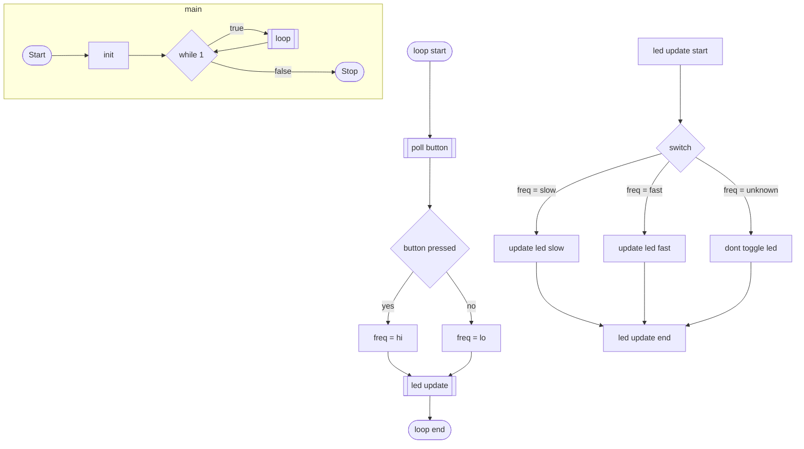

```mermaid
flowchart TD
subgraph main
	sta([Start])
	sto([Stop])
	init[init]
	loop[[loop]]
	while{while 1}
	
	sta --> init
	init --> while
	while --true--> loop
	loop --> while
	while --false---> sto
end

%% main end

lStart([loop start])
lEnd([loop end])
poll[[poll button]]
check{button pressed}
ledUp[[led update]]
fhi[freq = hi]
flo[freq = lo]

lStart --> poll
poll --> check
check -- yes --> fhi
check -- no --> flo
fhi --> ledUp
flo --> ledUp
ledUp --> lEnd

%% loop end

lUS[led update start]
lUE[led update end]
swi{switch}
fslow[update led slow]
ffast[update led fast]
none[dont toggle led]

lUS --> swi
swi -- freq = slow--> fslow
swi -- freq = fast--> ffast
swi -- freq = unknown--> none
fslow-->lUE
ffast-->lUE
none-->lUE
lUE

```

## notes
