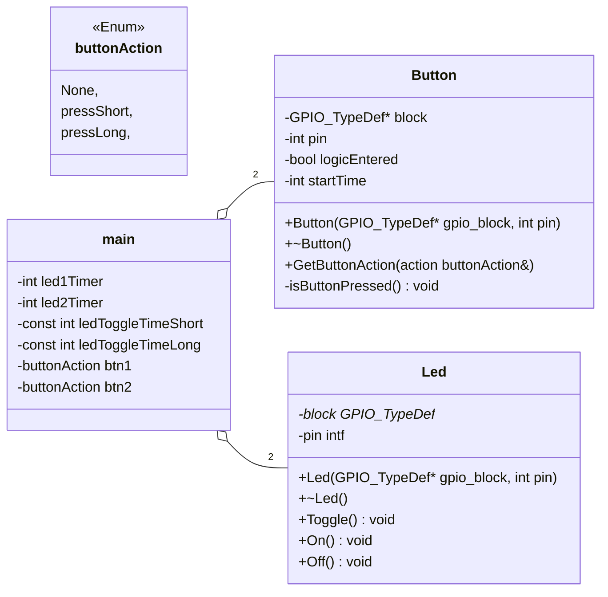
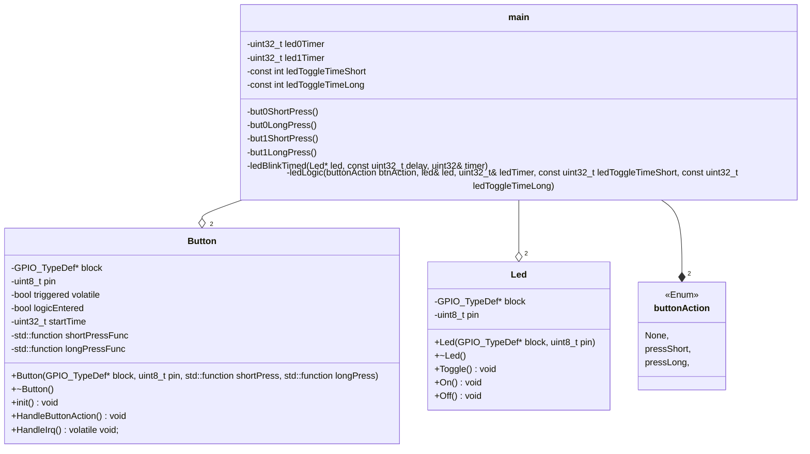
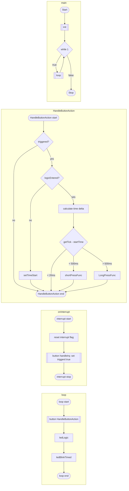

---
tags:
  - ES
  - nucleo
---

# GPIO challenge notes

## class diagram

### polling

---

### interrupts

> `std::function` = C++ `std::function<void()>`

## flowchart

### polling

### interrupt

