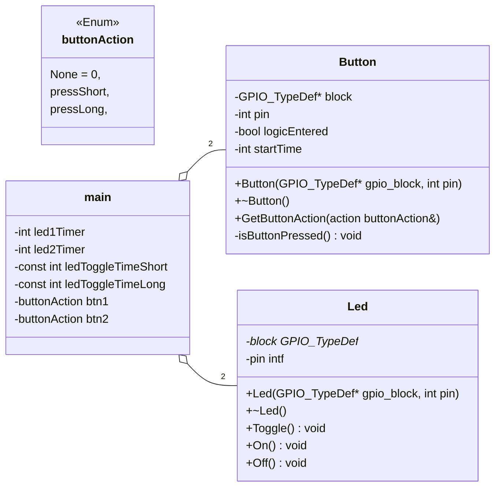
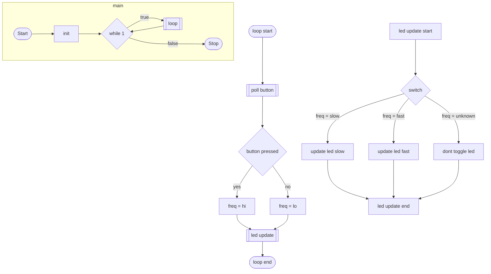

---
tags:
  - ES
  - nucleo
---

## class diagram

```mermaid
classDiagram
direction LR

class Led{
	+Led(GPIO_TypeDef* gpio_block, int pin)
	+~Led()
	+Toggle() void
	+On() void
	+Off() void
	-block GPIO_TypeDef*
	-pin intf
}

class buttonAction {
	<<Enum>>
	None = 0,
	pressShort,
	pressLong,
}

class Button {
	+Button(GPIO_TypeDef* gpio_block, int pin)
	+~Button()
	+GetButtonAction(action buttonAction&)
	-isButtonPressed() void
	-GPIO_TypeDef* block
	-int pin
	-bool logicEntered
	-int startTime
}

class main {
	-int led1Timer
	-int led2Timer
	-const int ledToggleTimeShort
	-const int ledToggleTimeLong
	-buttonAction btn1
	-buttonAction btn2
}

main o-- "2" Button
main o-- "2" Led

```

## flowchart

```mermaid
flowchart TD
subgraph main
	sta([Start])
	sto([Stop])
	init[init]
	loop[[loop]]
	while{while 1}
	
	sta --> init
	init --> while
	while --true--> loop
	loop --> while
	while --false---> sto
end

%% main end

lStart([loop start])
lEnd([loop end])
poll[[poll button]]
check{button pressed}
ledUp[[led update]]
fhi[freq = hi]
flo[freq = lo]

lStart --> poll
poll --> check
check -- yes --> fhi
check -- no --> flo
fhi --> ledUp
flo --> ledUp
ledUp --> lEnd

%% loop end

lUS[led update start]
lUE[led update end]
swi{switch}
fslow[update led slow]
ffast[update led fast]
none[dont toggle led]

lUS --> swi
swi -- freq = slow--> fslow
swi -- freq = fast--> ffast
swi -- freq = unknown--> none
fslow-->lUE
ffast-->lUE
none-->lUE
lUE

```
