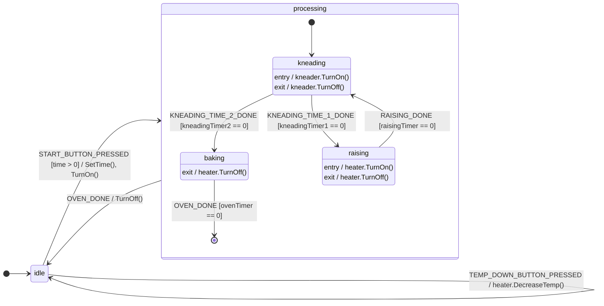

# breadbake state diagram

```mermaid
stateDiagram-v2
    direction LR

    state "idle" as s
    state "processing" as p
    state "baking" as b
    state "raising" as r
    state "kneading" as k

    r: entry / heater.TurnOn()
    r: exit / heater.TurnOff()

    b: exit / heater.TurnOff()

    k: entry / kneader.TurnOn()
    k: exit / kneader.TurnOff()

    [*] --> s
    s --> s : TIMER_UP_BUTTON_PRESSED / timer.IncreaseTime()
    s --> s : TIMER_DOWN_BUTTON_PRESSED / timer.DecreaseTime()
    s --> s : TEMP_UP_BUTTON_PRESSED / heater.IncreaseTemp()
    s --> s : TEMP_DOWN_BUTTON_PRESSED / heater.DecreaseTemp()

    s --> p : START_BUTTON_PRESSED [time > 0] / SetTime(), TurnOn()
    state p {
        %%direction LR
        [*] --> k
        k --> r : KNEADING_TIME_1_DONE [kneadingTimer1 == 0]
        r --> k : RAISING_DONE [raisingTimer == 0]
        k --> b : KNEADING_TIME_2_DONE [kneadingTimer2 == 0]
        b --> [*] : OVEN_DONE [ovenTimer == 0]
    }
    p --> s : OVEN_DONE / TurnOff()
```
