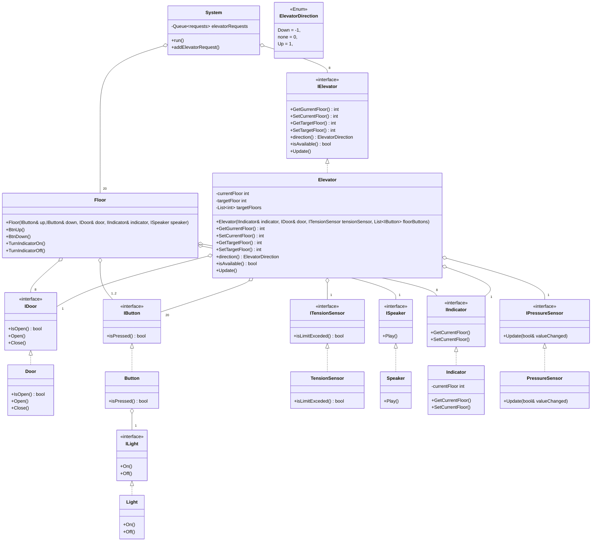

---
tags:
  - SD
  - diagrams
---

```mermaid
classDiagram 
direction TB
class System {
	+run()
	+addElevatorRequest()
	-Queue~requests~ elevatorRequests
}
class IDoor {
	<<interface>>
	+IsOpen() bool
	+Open()
	+Close()
}
class Door {
	+IsOpen() bool
	+Open()
	+Close()
}
class IButton {
	<<interface>>
	+isPressed() bool
}
class Button {
	+isPressed() bool
}
class ITensionSensor {
	<<interface>>
	+isLimitExceded() bool	
}
class TensionSensor {
	+isLimitExceded() bool	
}
class ILight {
	<<interface>>
	+On()
	+Off()
}
class Light {
	+On()
	+Off()
}
class ISpeaker {
	<<interface>>
	+Play()
}
class Speaker {
	+Play()
}
class IIndicator {
	<<interface>>
	+GetCurrentFloor()
	+SetCurrentFloor()
}
class Indicator {
	-currentFloor int
	+GetCurrentFloor()
	+SetCurrentFloor()
}
class Floor {
	+Floor(IButton& up,IButton& down, IDoor& door, IIndicator& indicator, ISpeaker speaker)
	+BtnUp()
	+BtnDown()
	+TurnIndicatorOn()
	+TurnIndicatorOff()
}
class ElevatorDirection {
    <<Enum>>
    Down = -1,
    none = 0,
    Up = 1,
}
class IElevator {
	<<interface>>
	+GetGurrentFloor() int
	+SetCurrentFloor() int
	+GetTargetFloor() int
	+SetTargetFloor() int
	+direction() ElevatorDirection
	+isAvailable() bool
	+Update()
}
class Elevator {
	+Elevator(IIndicator& indicator, IDoor& door, ITensionSensor tensionSensor, List~IButton~ floorButtons)
	-currentFloor int
	-targetFloor int
	+GetGurrentFloor() int
	+SetCurrentFloor() int
	+GetTargetFloor() int
	+SetTargetFloor() int
	+direction() ElevatorDirection
	+isAvailable() bool
	+Update()
	-List~int~ targetFloors
}
class IPressureSensor {
    <<interface>>
    +Update(bool& valueChanged)
}
class PressureSensor {
    +Update(bool& valueChanged)
}

%% relations --------------------------------

System o--"8" IElevator
System o--"20" Floor

Floor o--"1..2" IButton
Floor o--"8" IDoor
Floor o--"8" IIndicator
Floor o--"1" ISpeaker

Elevator o--"1" IIndicator
Elevator o--"1" IDoor
Elevator o--"20" IButton
Elevator o--"1" ITensionSensor
Elevator o--"1" IPressureSensor

IButton <|.. Button
IDoor <|.. Door
ILight <|.. Light
ISpeaker <|.. Speaker
IIndicator <|.. Indicator
IElevator <|.. Elevator
ITensionSensor <|.. TensionSensor
IPressureSensor <|.. PressureSensor

Button o--"1" ILight
```