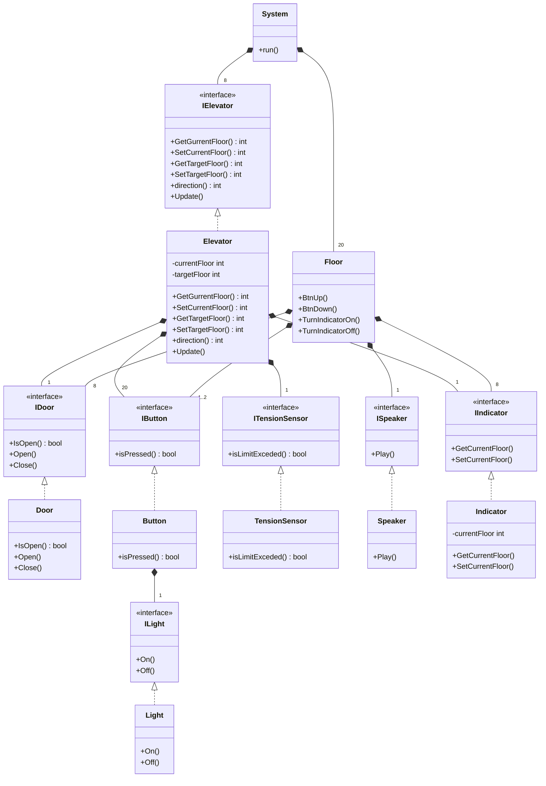

> - replace filled in `diamonds` with open ones for the interfaces
> - add `CTOR` for `elevator` and `floor`

```mermaid
classDiagram 
direction TB
class System {
	+run()
}
class IDoor {
	<<interface>>
	+IsOpen() bool
	+Open()
	+Close()
}
class Door {
	+IsOpen() bool
	+Open()
	+Close()
}
class IButton {
	<<interface>>
	+isPressed() bool
}
class Button {
	+isPressed() bool
}
class ITensionSensor {
	<<interface>>
	+isLimitExceded() bool	
}
class TensionSensor {
	+isLimitExceded() bool	
}
class ILight {
	<<interface>>
	+On()
	+Off()
}
class Light {
	+On()
	+Off()
}
class ISpeaker {
	<<interface>>
	+Play()
}
class Speaker {
	+Play()
}
class IIndicator {
	<<interface>>
	+GetCurrentFloor()
	+SetCurrentFloor()
}
class Indicator {
	-currentFloor int
	+GetCurrentFloor()
	+SetCurrentFloor()
}
class Floor {
	+BtnUp()
	+BtnDown()
	+TurnIndicatorOn()
	+TurnIndicatorOff()
}
class IElevator {
	<<interface>>
	+GetGurrentFloor() int
	+SetCurrentFloor() int
	+GetTargetFloor() int
	+SetTargetFloor() int
	+direction() int
	+Update()
}
class Elevator {
	-currentFloor int
	-targetFloor int
	+GetGurrentFloor() int
	+SetCurrentFloor() int
	+GetTargetFloor() int
	+SetTargetFloor() int
	+direction() int
	+Update()
}

%% relations --------------------------------

System *--"8" IElevator
System *--"20" Floor

Floor *--"1..2" IButton
Floor *--"8" IDoor
Floor *--"8" IIndicator
Floor *--"1" ISpeaker

Elevator *--"1" IIndicator
Elevator *--"1" IDoor
Elevator *--"20" IButton
Elevator *--"1" ITensionSensor

IButton <|.. Button
IDoor <|.. Door
ILight <|.. Light
ISpeaker <|.. Speaker
IIndicator <|.. Indicator
IElevator <|.. Elevator
ITensionSensor <|.. TensionSensor

Button *--"1" ILight
```