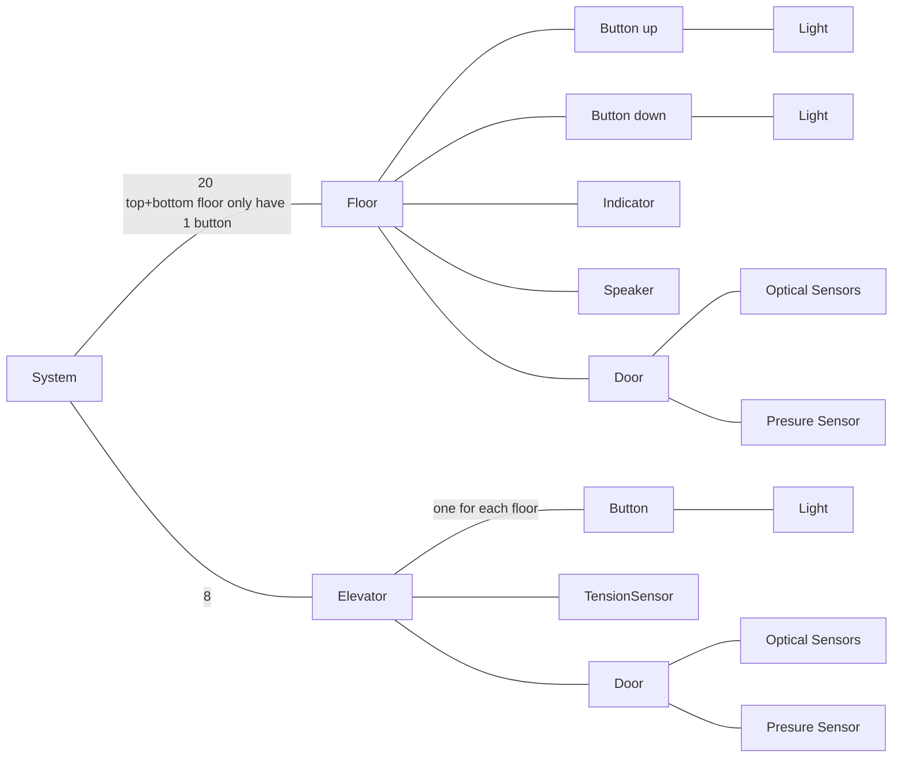

## requirements

- system
	- will respond to requests by sending the nearest elevator (already going in that direction, or the first idle)
	- if no elevators are available it will be pending until it can find an elevator that can accept the request
	- 8 elevators
		- cable tension sensors
			- monitor the tension on the cable controlling the elevator
			- if the measured level is below a critical value 4 external locking clamps will engage and lock the elevator in place
		- contains buttons for
			- desired floor (floor request)
			- are back-lit once pressed, light turns off after elevator arrived.
			- pressing after a request is send does nothing until the elevator passed it.
			- if the button is pressed and an elevator is present (and heading in the desired direction) the doors will stop closing and the timeout reset.
		- indicator (current floor)
		- door
			- pressure and optical sensors to prevent closing when blocked. when either sensor is triggered
				- close timeout restarts if either sensor is triggered
			- closes after a timeout (5 sec after opening)
	- 20 floors
		- each floor (except the first and last) have 2 request buttons (up and down)
		- elevator indicator (which floor + direction)
		- doors
		- - speaker
			- notifies the user that an elevator arrived at the floor

## object diagram

