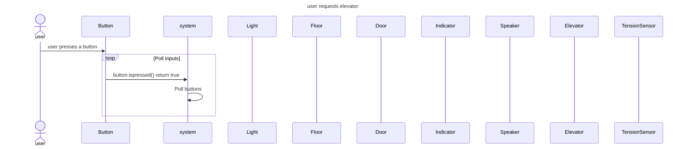

```mermaid
---
title: user requests elevator
---
sequenceDiagram

actor U as user
participant B as Button
participant S as system
participant L as Light
participant F as Floor
participant D as Door
participant I as Indicator
participant SP as Speaker
participant E as Elevator
participant T as TensionSensor

%% ---------------------------------

U->>B: user presses a button
loop Poll inputs
B->>S: button.ispressed() return true
S->>S: Poll buttons
end

%%U->>B: presses button
%%B->>L: Light.On()
%%L-->>B: 
```
