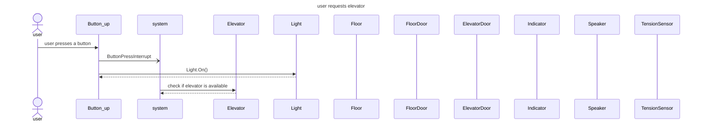

---
tags:
  - SD
  - diagrams
---

>...

## diagram

```mermaid
---
title: user requests elevator
---
sequenceDiagram

%%TODO fix order when done
actor U as user
participant B as Button_up 
participant S as system
participant E as Elevator
participant L as Light
participant F as Floor
participant Df as FloorDoor
participant De as ElevatorDoor
participant I as Indicator
participant SP as Speaker
participant T as TensionSensor

%% ----------------------------------------

%% begin block button interrupt press
U->>B: user presses a button

B-)S: ButtonPressInterrupt
%%S-->>B: 

B->>L: Light.On()
L-->>B: 
%% end block button interrupt press

S->>E: check if elevator is available
E-->>S: 


```

> Button_up can also be button_down