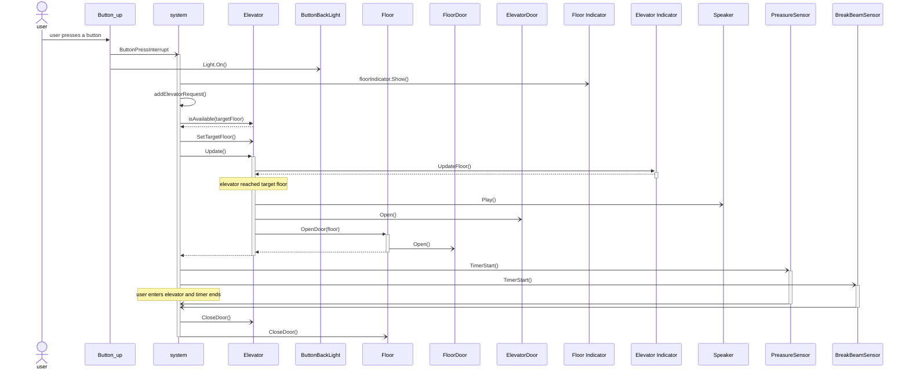

---
tags:
  - SD
  - diagrams
---

# sequence diagram

> title: user requests elevator

> `Button_up` can also be `button_down`

## assumptions

- elevators are on random floors
- all elevators are empty
