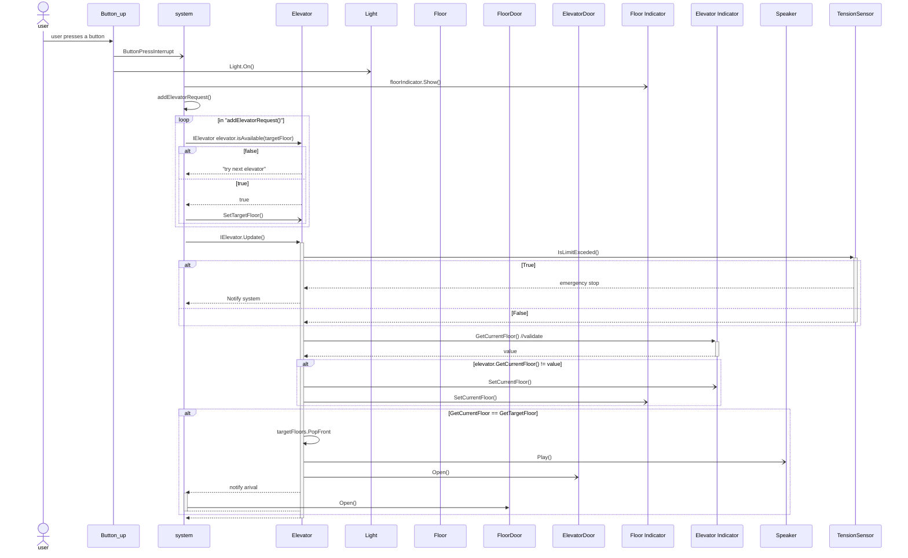

---
tags:
  - SD
  - diagrams
  - todo
---

# sequence diagram

> title: user requests elevator

> `Button_up` can also be `button_down`

### todo

- [ ] validate `GetCurrentFloor()`
- [ ]  start door timer
- [ ] close door at end of timer

### assumptions

- elevators are on random floors
- all elevators are empty
