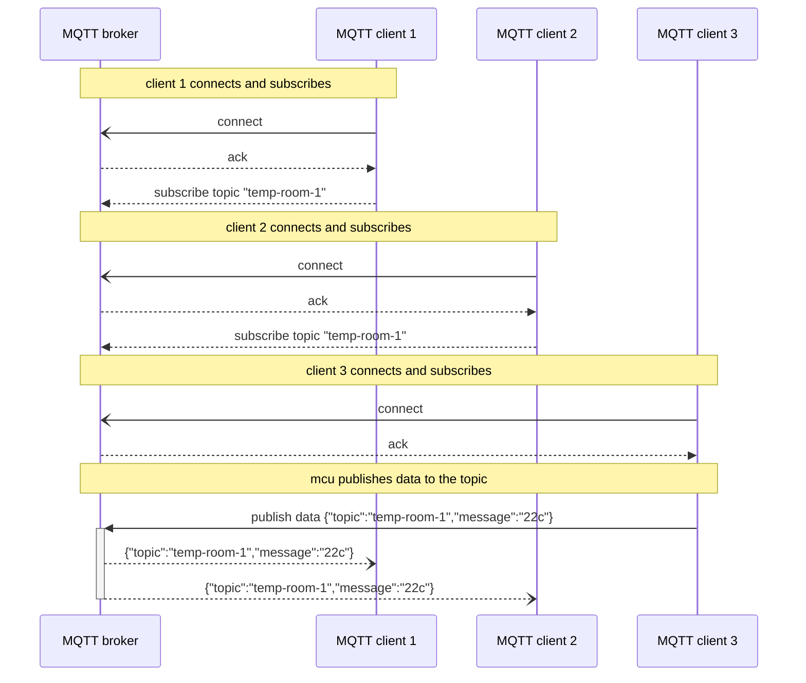

# Communication protocol assignment

[Fig. 1][coap_layout]

2023-10-27
Karlo Koelewijn

## Content

- [Communication protocol assignment](#communication-protocol-assignment)
  - [Content](#content)
  - [Introduction](#introduction)
  - [analysis](#analysis)
    - [MQTT](#mqtt)
      - [MQTT protocol](#mqtt-protocol)
      - [MQTT requirements](#mqtt-requirements)
      - [MQTT constraints/limitations](#mqtt-constriantslimitations)
      - [MQTT Diagram](#mqtt-diagram)
    - [CoAp](#coap)
      - [CoAp protocols](#coap-protocols)
      - [CoAp requirements](#coap-requirements)
      - [CoAp constraints/limitations](#coap-constraintslimitations)
      - [CoAp Diagram](#coap-diagram)
  - [discussion](#discussion)
    - [differences](#differences)
    - [comparisons](#comparisons)
  - [conclusion](#conclusion)
    - [smart home](#smart-home)
    - [factory production line](#factory-production-line)
    - [wildlife camera](#wildlife-camera)
  - [references](#references)

## Introduction

To determine the differences between 2 communication protocols, MQTT and CoAp. we look at both protocols, determine their pros and cons, and discus a few use cases for each application. 
This time its between 2 protocols, but by doing this we learn how to objectively look at concepts and determine how they can be used, what they can be used for and how to compare different concepts.

## analysis

I went through the following steps to learn about each protocol.

1. look up the protocols
2. look at the requirements
3. look at the constraints/limitations

### MQTT

#### MQTT protocol

- light weight
- uses tcp

#### MQTT requirements

- requires a broker
- clients connect to broker

#### MQTT constraints/limitations

- higher power consumption
- easy to implement
- subscriber based setup

#### MQTT Diagram

- client 1 -> mcu diaplaying info
- client 2 -> server logging data
- client 3 -> mcu measuring data

### CoAp

#### CoAp protocols

- designed for
  - micro controllers
  - resource constrained internet device
- protocol easily translates to http

#### CoAp requirements

- Application layer protocol

#### CoAp constraints/limitations

- low overhead and simple
- for IOT (internet of things) and M2M (machine to machine)
- can run on most devices that support udp
- restful API

#### CoAp Diagram

[Fig. 1][coap_layout]

possible setups

- m2m (machine to machine)
- machine to server
- client to server
- client to proxy to server

## discussion

There are a few comparisons to be found, but naturally also some differences, lets point them out.

### differences

- MQTT requires a broker while CoAp does not
- MQTT uses the subscriber modal while CoAp acts like a RESTful api
- MQTT requires more power
- MQTT needs 'ordered lossless, bidirectional' communication while CoAp can run on most devices that support the udp standard

### comparisons

- both can
  - do M2M (machine to machine)
  - use multiple transport protocol
    - MQTT
      - tcp
      - QUIC
    - CoAp
      - udp
      - SMS
      - cellular
- both don't mention error correction

## conclusion

now that we know their pros and cons lets look at a fe scenarios and my advice for which protocol to use.

each scenario wil have some context, my advice and why.

### smart home

context

someone wants to make his home 'smart'. for example: only turn on the lights if someone is in that room, turn on the floor heating in a room when someone is there, open and close doors using a servo and a distance sensor, logging activities, etc.

the systems want to be notified of changes, like a person changing rooms.

the smart home system is made from multiple smaller systems

---

advice: mqtt

mqtt works on a subscriber based system, meaning that once something changes everything listening to that 'channel' gets notified and can act accordingly.

### factory production line

a factory consisting of modules. each module has a status and has to communicate with other modules about their input/output. the system has to run continuously and be able to accept recipe changes.

when using CoAP u would need to continuously request information, which would take up bandwith on your home network which does not need to happen.

---

advice: mqtt

due to the system having to communicate based on changes in the modules state i would recommend mqtt over CoAP, as CoAP acts more like a restful API. having to request each time u need to check multiple modules is inefficient, when u can have a central place that notifies the module on changes.

### wildlife camera

a wildlife cam hanging in a forest taking pictures of passing wild life for research purposes, checking population, keeping tabs of what lives there. it is power constrained by having to run on battery, and has to run for long periods of time as to not disturb wildlife. aiming to have a camera module hang in a location for multiple months/years

---

advice: CoAp

due to power consumption and remote locations being major factors. images being larger does not allow them to be send over CoAp, but will instead be saved on a storage medium included in the module. instead a system can periodicaly (think 1x/month) how many pictures are taken or when the storage medium is full.

## references

[coap_layout]: <https://www.mdpi.com/1424-8220/20/21/6391>
[wiki_coap]: <https://en.wikipedia.org/wiki/Constrained_Application_Protocol>
[wiki_mqtt]: <https://en.wikipedia.org/wiki/MQTT>

- [mqtt information source][wiki_mqtt]
  - raw link: <https://en.wikipedia.org/wiki/MQTT>
- [coap information source][wiki_coap]
  - raw link: <https://en.wikipedia.org/wiki/Constrained_Application_Protocol>
- Fig. 1: [source][coap_layout]
  - raw link: <https://www.mdpi.com/1424-8220/20/21/6391>
