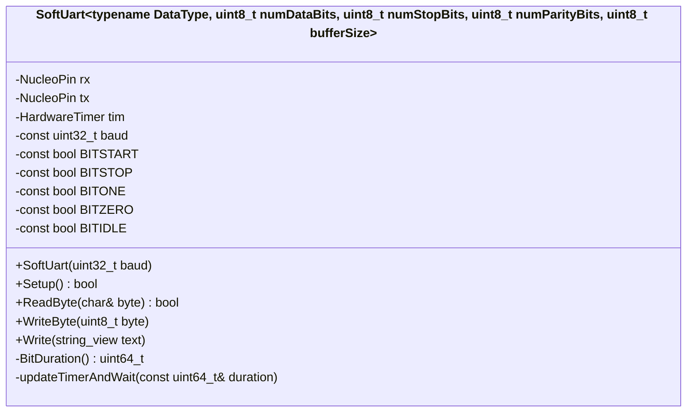
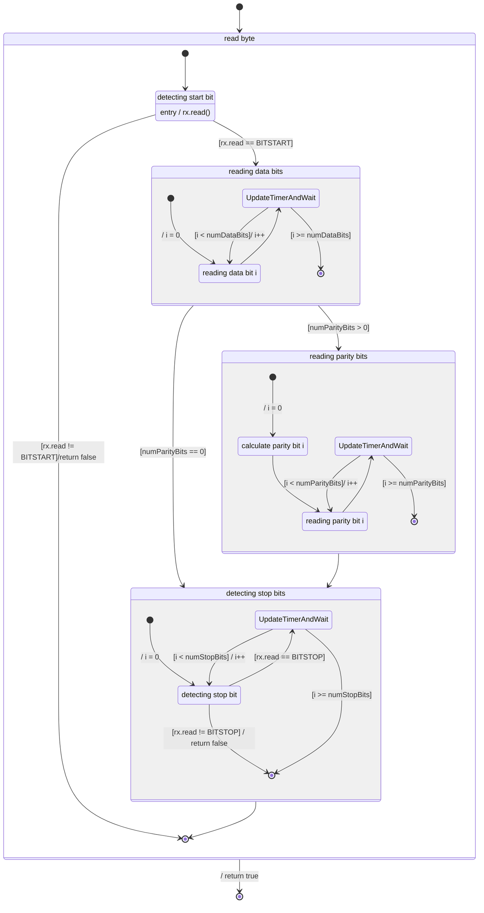
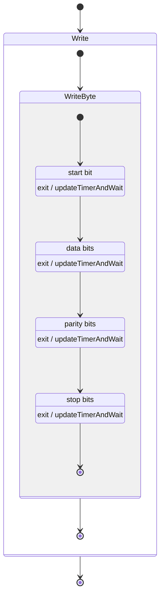

---
tags:
  - uart
  - COMM
---

# uart notes

## usefull links

| reason | url |
|---|---|
| configure minicom | <https://www.css-techhelp.com/post/configure-minicom-for-a-usb-to-serial-converter> |

## todo

- [x] write serial writer poc on uno
  - using digital read/write
  - uno r3 is too slow to write at `115200` baud rate
  - tested
    - [x] 9600 (succes)
    - [x] 14400 (succes)
    - [x] 19200 (failed, not fast enough)
    - [x] 115200 (failed, not fast enough)
- [x] write serial reader poc on uno
- [x] write MMIO serial writer poc on uno
- [x] write MMIO serial reader poc on uno
- [x] write serial reader/writer poc on nucleo
  - tested speeds
    - [x] 9600 (succes)
    - [x] 38400 (succes)
    - [x] 57600 (succes)
    - [x] 115200 (does not work. output gets garbeld)
- [x] state diagram
  - use the function names to link them
- [ ] report
  - [ ] update intro?
  - [ ] tests
  - [ ] conclusion

## info

| bit | value | info |
| --- | --- | ---|
| `start` | digital `0` | signifies the start of a byte |
| `stop` | digital `1` | signifies the stop of a byte |
| `on` | digital `1` | on value of the bit in the byte |
| `off` | digital `0` | off value of the bit in the byte |
| `idle` | digital `1` | idle state of the serial line |

## class diagram

## state diagram

> arrows with no guard can be considered an else case

### old version

