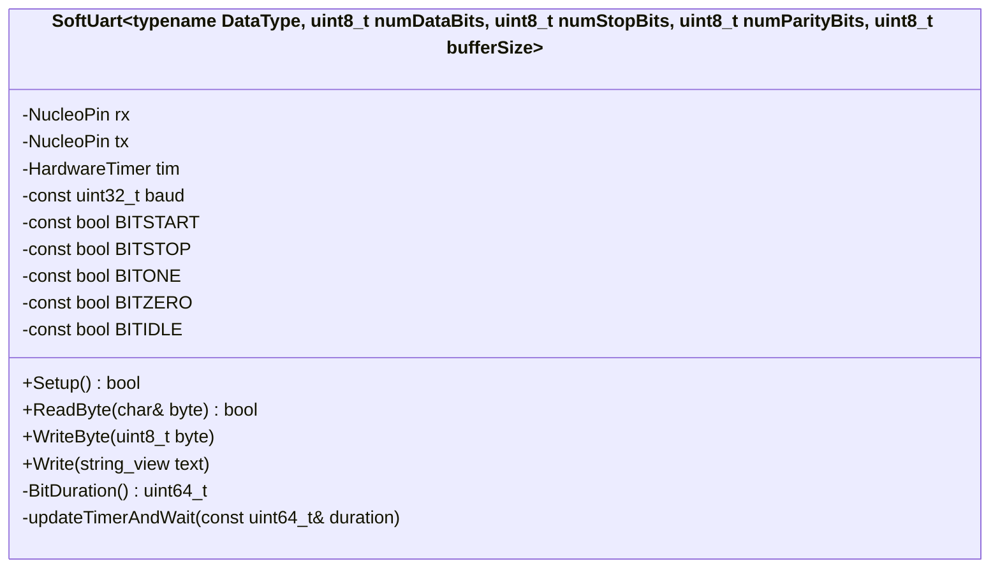

# uart report

2024-01-14
Karlo Koelewijn

## history

| date | version | author | notes |
| :---: | :---: | :---: | --- |
| 2024-01-14 | 0.1 | Karlo | started v0.1, added T.O.C., intro, research, started design and advice |
<!-- |  |  |  |  | -->

## content

- [uart report](#uart-report)
  - [history](#history)
  - [content](#content)
  - [introduction](#introduction)
  - [research](#research)
    - [main question](#main-question)
    - [sub questions](#sub-questions)
      - [how does uart work](#how-does-uart-work)
        - [uart msg example](#uart-msg-example)
          - [message we send](#message-we-send)
          - [uart message structure](#uart-message-structure)
          - [actual messages](#actual-messages)
          - [named bit definitions](#named-bit-definitions)
      - [how can we transfer the data](#how-can-we-transfer-the-data)
        - [sending](#sending)
        - [recieving](#recieving)
  - [design](#design)
    - [class diagram](#class-diagram)
  - [advice](#advice)
  - [conclusion](#conclusion)

## introduction

this is my uart research report. im writing this because i needed to learn how to make one because another assignment expected the default uart not to work on the nucleo board due to the required pins for driving all its components.

## research

### main question

> how do i write software uart running faster than 9600 on a nucleo f303re without using HAL[^1] methods?

[^1]: Hardware Abstraction Layer

### sub questions

#### how does uart work

uart (universal asynchronous receiver-transmitter) usses serial communication. meaning it sends each byte after the other.
each message is comprised of a start bit to notify the other side that it is about to send something,
followed by 5 to up to 9 data bits, which can be followed by 0 up to 2 parity bits and 1 or 2 stop bits.
do note that the total amount of bits send per message cannot exceed 9 bits (excluding start and stop)
the data is send at a pre configured speed which means it does not need a shared clock signal.

##### uart msg example

###### message we send

> A

###### uart message structure

> \<start bit>\<n data bits>\<n parity bits>\<n stop bits>

dataBits: 5-9

parityBits: 0-2

stopBits: 1-2

messages can be 'chained' by putting a `idle` bit between data bits instead of fully stopping.

###### actual messages

> this shows a program receiving a byte, incrementing it, and sending it back.
>

---

> this shows a string of text being send
>
>above shows hex, below shows ascii. the message is the same
>
>`[09]` == `\t` aka a tab  
>`[0A]` == `\n` aka a new line

###### named bit definitions

| bit | value | info |
| --- | --- | ---|
| `start` | digital `0` | signifies the start of a byte |
| `stop` | digital `1` | signifies the stop of a byte |
| `on` | digital `1` | on value of the bit in the byte |
| `off` | digital `0` | off value of the bit in the byte |
| `idle` | digital `1` | idle state of the serial line |

#### how can we transfer the data

##### sending

we can use 2 microcontroller pins seeing as we need 2 'channels', 1 to send and 1 to receive, and we are dealing with bits and bytes.
we split each byte up into bits and send each bit over the 'output channel' whith a 'delay' between each bit. the 'delay' is determined by the speed we set for the uart, and the bit determinds if the corosponding pin high on a `1` or low on a `0`.

##### recieving

receiving is fairly similar to sending, but instead of setting a pin we read it at the baudrate that is configured.

## design

---
> design choices
>
> why this design, what other choices could i have made
---

### class diagram

## advice

as of writing this document my implementation does not implement the parity calulations yet due to time constraints, however it can go upto 57600 baud without problems.
the next step up would be 115200 but the way i have my timer setup wont allow the use of that speed.
i have tested 9600, 38400, and 57600 baud and speeds below that should work fine.
the numer of bits is configurable for the data bits, parity bits and the stop bits, any unsuported number will be cautght using a static_assert.
the code is blocking and not thread safe so keep that in mind.

## conclusion

---
> what did i thingk of the project
---
