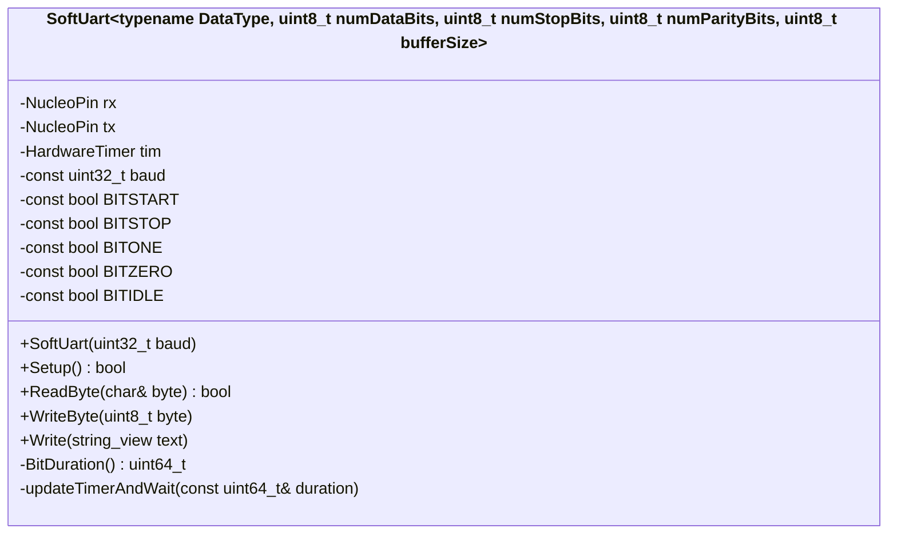
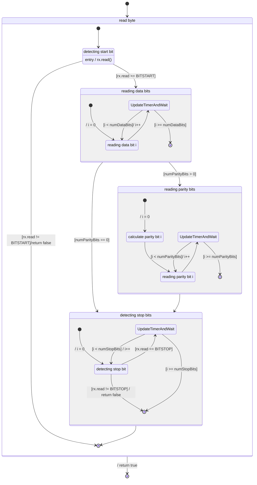

# uart report

2024-01-14
Karlo Koelewijn

## history

| date | version | author | notes |
| :---: | :---: | :---: | --- |
| 2024-01-14 | 0.1 | Karlo | started v0.1, added T.O.C., intro, research, started design and advice |
| 2024-01-17 | 0.2 | Karlo | updated advice, added tests header added state diagram, fixed a few formatting issues, updated design + advice |
| 2024-01-23 | 0.3 | Karlo | spelling checking, dot-framework, finished reflection |
<!-- |  |  |  |  | -->

## content

- [uart report](#uart-report)
  - [history](#history)
  - [content](#content)
  - [introduction](#introduction)
  - [research](#research)
    - [main question](#main-question)
    - [sub questions](#sub-questions)
      - [how does uart work](#how-does-uart-work)
        - [uart msg example](#uart-msg-example)
          - [uart message structure](#uart-message-structure)
          - [message we send](#message-we-send)
          - [actual messages](#actual-messages)
          - [named bit definitions](#named-bit-definitions)
      - [how can we transfer the data](#how-can-we-transfer-the-data)
        - [sending](#sending)
        - [receiving](#receiving)
  - [design](#design)
    - [class diagram](#class-diagram)
    - [state diagram](#state-diagram)
  - [tests](#tests)
  - [advice](#advice)
  - [conclusion](#conclusion)
  - [reflection](#reflection)

## introduction

this is my uart research report. im writing this because i needed to learn how to make one because another assignment expected the default uart not to work on the nucleo board due to the required pins for driving all its components.

## research

during my research is made use of the dot-framework.  

- Expert interview
- literature study

from the library method.

### main question

> how do i write software uart running faster than 9600 on a nucleo f303re without using HAL (Hardware Abstraction Layer) methods?

### sub questions

#### how does uart work

uart (universal asynchronous receiver-transmitter) uses serial communication. meaning it sends each byte after the other.
each message is comprised of a start bit to notify the other side that it is about to send something,
followed by 5 to up to 9 data bits, which can be followed by 0 up to 2 parity bits and 1 or 2 stop bits.
do note that the total amount of bits send per message cannot exceed 9 bits (excluding start and stop)
the data is send at a pre configured speed which means it does not need a shared clock signal.  
to calculate the pre-configured speed or 'bit time' you divide 1 second by the 'bit time' (also called baudrate) $1/b$, so with 9600 baud the calculation becomes $1 / 9600 = 0,0001041666666666667$ s or $0.1042$ ms per bit.  

##### uart msg example

first i'll go over how it a message is structured, followed by how a message is send followed by the actual message and a table of name definitions.

###### uart message structure

> \<start bit>\<n data bits>\<n parity bits>\<n stop bits>

dataBits: 5-9

parityBits: 0-2

stopBits: 1-2

messages can be 'chained' by putting a `idle` bit between data bits instead of fully stopping.

###### message we send

> A

###### actual messages

> this shows a program receiving a byte, incrementing it, and sending it back.
>

---

> this shows a string of text being send.  
>   
> above shows hex, below shows ascii. the message is the same  
>   
> `[09]` == `\t` aka a tab  
> `[0A]` == `\n` aka a new line

###### named bit definitions

| bit | value | info |
| --- | --- | ---|
| `start` | digital `0` | signifies the start of a byte |
| `stop` | digital `1` | signifies the stop of a byte |
| `on` | digital `1` | on value of the bit in the byte |
| `off` | digital `0` | off value of the bit in the byte |
| `idle` | digital `1` | idle state of the serial line |

#### how can we transfer the data

##### sending

we can use 2 micro-controller pins seeing as we need 2 'channels', 1 to send and 1 to receive, and we are dealing with bits and bytes.
we split each byte up into bits and send each bit over the 'output channel' with a 'delay' between each bit. the 'delay' is determined by the speed we set for the uart, and the bit determines if the corresponding pin high on a `1` or low on a `0`.

##### receiving

receiving is fairly similar to sending, but instead of setting a pin we read it at the baudrate that is configured.

## design

during my design i made use of the following dot-framework methods.

- prototyping (from the workshop method)

i opted to make the class a template to hard-bake the number of data, parity and stop bits into the constructed implementation, this prevents the user from changing them in runtime.  
a `HardwareTimer` was added because of the need for specific timing and 2 `NucleoPins` were to act as a transmit and receive pin.  
the baudrate is given through the constructor because i wanted to allow the const savvy people to be able to change the baud rate at runtime. (event though it is not supported in the spec)

### class diagram

### state diagram

> arrows with no guard can be considered an else case

## tests

for testing i used A/B testing from dot-frameworks lab method

While i made a proof of concept on an arduino to get the logic down, i did test if it reached curtain speeds.  
the baudrates i tested in order on the uno:

- 9600 (success)
- 115200 (failure, millis-clock could not keep up)
- 19200 (failure, timing was off so it send bits too late)
- 14400 (success)

on the nucleo i did a few tests with different baudrates:

- 9600 (success)
- 38400 (native nucleo baud rate, success)
- 57600 (success)
- 115200 (failure, I used a hardware timer and used a generous prescaler which did not allow for this speed. could be fixed with more time.)

this image shows the nucleo uart before using a hardware timer, meaning that the timing is off by a lot.  

below is what receiving `hello world` looks like on uart, followed by a terminal running minicom printing it.  
(small note about minicom: i don't know why but it handles `\t` as a newline followed by a space)
  

below i'm showing the message with debugging pins to show when i'm sampling/toggling the rx/tx pin, first for a whole message and then for an individual bit.  
  

## advice

as of writing this document my implementation does not implement the parity calculations yet due to time constraints.  
without parity it achieves 57600 baud, but if i had implemented parity i would make an estimated guess that it would achieve 38400 baud.  
i tried the next step up (115200 baud) but the way i have my timer setup won't allow the use of that speed.  
i have tested 9600, 38400, and 57600 baud and speeds below that should work fine.  
the number of bits is configurable for the data bits, parity bits and the stop bits, and any unsupported number will be caught using a static_assert.  
the code is blocking and **not** thread safe so keep that in mind.

## conclusion

during this assignment I learned how a [uart message](<#uart-message-structure>) is composed, and how strict the timing can be with certain baudrates.  
to send the `HIGH` or `LOW` signals we set the TX pin to the corresponding state and wait until the bit duration is over, to read the bit we read the RX pin during the allocated time and save it in a variable.  
another important thing were the [start and stop conditions](<#named-bit-definitions>) for a message, because without those the message is invalid and can be discarded.

## reflection

I think this was an interesting project to work on, because I had to work with very specific timing.  
even though i had a rough understanding of uart already, it is good to know some details or why some things are done the way they are.  
even though i was not completely finished due to time constraints, i hope to plan it out better for my next semester.
