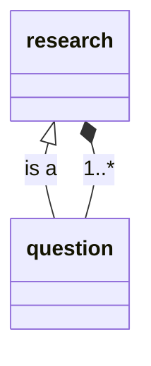

---
tags:
  - research
---

1. analyze
2. design
3. advise
4. implementation

---

- process information (research-based)
- determine the `main question`
- add `subquestion`
	- each `subquestion` can be its own `main question` to break the problem into smaller parts
- answer questions
- determine a conclusion

---

